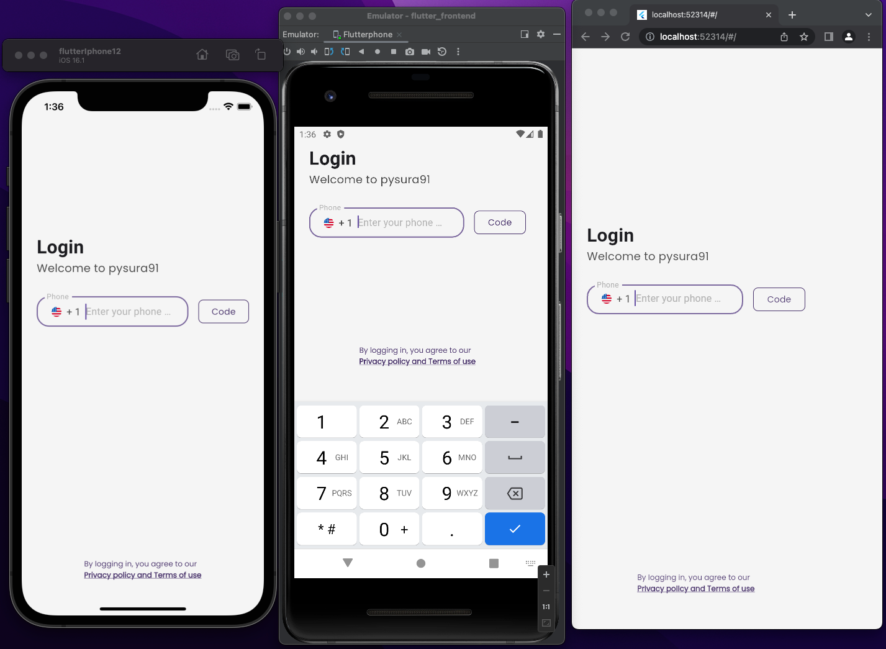

Pysura - BETA
=============

Hasura + Python = Pysura. An open source solution.
--------------------------------------------------

Because everyone should be a code wizard.

Requirements:
^^^^^^^^^^^^^

To deploy Hasura with Pysura with baked in Auth and a templated Flutter Frontend:
^^^^^^^^^^^^^^^^^^^^^^^^^^^^^^^^^^^^^^^^^^^^^^^^^^^^^^^^^^^^^^^^^^^^^^^^^^^^^^^^^

* Python 3.9+
* gcloud CLI
* gcloud beta CLI
* A billing account with Google Cloud
* Docker (Make sure it's running in the background or your deployment will fail!)
* Firebase CLI
* npm
* Dart
* Flutter

.. code-block:: commandline

   pip install pysura
   pysura
   (pysura_cli) >>> setup_pysura

Note: The installer is doing a lot of things. Some of them take a long time, like creating databases, firewalls, and VPC
networks. Sometimes it might look frozen, but give it some time to do its thing. It's automagically building an entire
application for you. I promise doing this by hand takes longer. ;)

Useful Pysura commands:
^^^^^^^^^^^^^^^^^^^^^^^

* ``deploy_frontend`` - Rebuild and Deploy the web frontend to firebase hosting for release
* ``deploy_microservice`` - Regenerate routers and re-deploy the default microservice
* ``print_pysura`` - Prints important pysura details like login credentials for the project
* ``import_hasura_metadata`` - Import the hasura metadata from Hasura
* ``export_hasura_metadata`` - Export the hasura metadata to Hasura
* ``gcloud_deploy_hasura`` - Deploy the hasura microservice to GCloud
* ``import_existing_hasura`` - Clone an existing Hasura empty Hasura instance. Full clone, from metadata and pg_dump
  including pulling ENUM values and cloning those.

Is this multi-platform compatible?
----------------------------------

Mac - Yes, I developed it on a Mac!

Linux - It should work on Linux, it is untested. Let me know!

Windows - With minor updates it should work. I think the majority of the deployer works, but it might run into issues on
the Firebase and Flutterfire CLI's.

What is Pysura?
---------------

Pysura is a CLI tool that's designed to make building and deploying multi-tenant enterprise grade applications as easy
as a freshman year algorithms class. It's a highly opinionated way because it's the right way.

It's kind of like running npm init, if npm was for backends and frontends, it provides your backend, auth, and database
for you in the cloud in a way that is infinitely scalable and uses zero-trust, with a type-safe GraphQL backend and a
bring-your-own front-end approach with special built-in support for Flutter which is the default setup.

Why Flutter?

So that it doesn't matter what you are building, you can build it on Pysura. It's about damn time that Python developers
have better mobile support. Let's bring python to mobile. Let's bring python to the web. Let's bring python to the edge.
Let's bring python everywhere. And let's skin it with Flutter and feed it all the data it wants with GraphQL and Hasura.

Do I have to use Flutter for the frontend? No way! Pysura places firebase in front of your Hasura instance, so if your
frontend of choice supports Firebase Auth integrations or libraries, you can use it, or even better open a PR and add a
template for your provider. You *do* need Flutter for installation

What does the Pysura installer do?
^^^^^^^^^^^^^^^^^^^^^^^^^^^^^^^^^^

* Authenticates you with gcloud
* Creates a new project in Google Cloud
* Sets up a VPC network inside the project
* Creates a new Cloud SQL instance running Postgres 14
* Stores all Env variables in secret manager to be loaded from containers
* Creates a new Hasura instance in Cloud Run with scaling settings always allocating memory for at least 1 instance
* Attaches Firebase to the project
* Deploys firebase functions triggering on user.create/delete managing Hasura user data each with min instances set to 1
* Adds JWT authentication via Firebase to Hasura with phone sign in
* Creates a new Flutter app with Firebase Auth using flutterfire
* Configures Android signing keys (COMING SOON: Auto app icon configuration)
* Configures iOS URL schemes (COMING SOON: Auto app icon configuration)
* Updates the default flutter template to use the Pysura template for Flutter
* Deploys the flutter template to Firebase hosting for the web. (COMING SOON: Auto app icon configuration)
* Deploys a default microservice on Cloud Run using Pysura! Includes default event that handles JWT claim changes

You will have this exact app after running the installer, it will work on iOS, Android, Web, Mac, and as a Chrome web
app. Untested on Linux/Windows native but it should work. ;) 

https://pysura-demo-2.web.app/

What is a Pysura Microservice?
^^^^^^^^^^^^^^^^^^^^^^^^^^^^^^

It's a wrapper around a FastAPI app that holds a collection of actions, events, and chron-jobs related to its function.
I.e. A payment microservice might have all code related to payment processing. It bakes in Auth with an extra decorator
which gives you easy access to the calling user each time a method is called. This works by using opaque tokens that
pass through the headers into the microservice. It's a very simple way to do auth, and it's very secure. It gives full
RBAC at a column level, and you can design rather complex auth rules using Hasura's permission system. Each action,
event, and chron-job is placed in a separate file with routing already handled and the calling users information passed
in the calling context. It makes it very easy to build your business logic in a clean, consistent way that is easy to
test and maintain, and also easy to hand off to other developers.

Pysura uses middleware to handle the auth, and provide you access to app resources like the database, and the caller. It
wraps FastAPI, and uses a router for each action, event, or chron-job. Separating the business logic into collections of
microservices each containing folders of actions, events, and chron-jobs each delegated to their own file which makes it
easy to scale and maintain.

Front-end clients should utilize the Hasura GraphQL API to access and mutate the data in the database. This is the
recommended way to access the data. It is important to make sure you set up proper roles and permissions in Hasura to
ensure that only the correct users can access the data meant for them. By default, Pysura includes a user and admin role

Actions are used to allow the front-end client a way to perform custom business logic, or do a task that requires
calling third party APIs or services. Actions are called via the Hasura GraphQL API, and are executed on the
microservice instance.

Events are used to trigger custom business logic when something occurs in the database. For example, when a user is
created, you might want to send them a welcome email. Events are triggered by Hasura (via the Database), and are
executed on the microservice instance.

Crons are used to trigger custom business logic on a schedule. For example, you might want to send a report to the admin
every day at 8am. Crons are triggered by Hasura (via the Database), and are executed on the microservice instance.

By default, the application is configured with an event secret that must be passed to all microservices in the header
from Hasura. This ensures that all traffic is coming from Hasura, and not from a malicious source. This makes things
SUPER secure, with JWT auth, and event secrets. It's a very secure way to build an application.

The default microservice directory structure looks like this:

* microservices/default

  * microservices/default/Dockerfile
  * microservices/default/README.md

* microservices/default/actions

  * microservices/default/actions/\ **init**.py
  * microservices/default/actions/action_mutation_pong.py
  * microservices/default/actions/action_query_ping.py
  * microservices/default/actions/action_upload_file.py
  * microservices/default/app.py
  * microservices/default/app_secrets.py

* microservices/default/crons

  * microservices/default/crons/\ **init**.py
  * microservices/default/crons/cron_update_app_message.py
  * microservices/default/deploy.txt

* microservices/default/events

  * microservices/default/events/\ **init**.py
  * microservices/default/events/event_update_user_cascade.py
  * microservices/default/events/event_update_user_role.py
  * microservices/default/generated_types.py
  * microservices/default/pysura_metadata.json
  * microservices/default/requirements.txt

Here, you can see app secrets are loaded from Secret manager in the app_secrets.py file:

app_secrets.py

.. code-block:: python

   from google.cloud import secretmanager

   PROJECT_ID = "pysura-demo-2"

   def get_secret_by_id(secret_id, version_id="latest"):
       client = secretmanager.SecretManagerServiceClient()
       name = f"projects/{PROJECT_ID}/secrets/{secret_id}/versions/{version_id}"
       response = client.access_secret_version(name=name)
       return response.payload.data.decode("UTF-8")

   print("LOADING SECRETS")
   HASURA_GRAPHQL_ADMIN_SECRET = get_secret_by_id("HASURA_GRAPHQL_ADMIN_SECRET")
   HASURA_GRAPHQL_URL_ROOT = get_secret_by_id("HASURA_GRAPHQL_URL_ROOT")
   HASURA_EVENT_SECRET = get_secret_by_id("HASURA_EVENT_SECRET")
   HASURA_FIREBASE_SERVICE_ACCOUNT = get_secret_by_id("HASURA_FIREBASE_SERVICE_ACCOUNT")
   HASURA_STORAGE_BUCKET = get_secret_by_id("HASURA_STORAGE_BUCKET")
   HASURA_GRAPHQL_DATABASE_URL = get_secret_by_id("HASURA_GRAPHQL_DATABASE_URL")

In the app.py file, we inject the Pysura security middleware:

.. code-block:: python

   @app.middleware("http")
   async def inject_security(request: Request, call_next):
       return await security_injection_middleware(request, call_next)

This is going to handle injecting the identity of the caller into the function directly from the JWT token.

The composition of all events, actions, and crons is as follows:

The PysuraSecurity callable class is used to inject the security middleware into the FastAPI app. It makes it easy to
specify whether or not the route requires JWT authentication, what level of JWT authentication is required, and if the
caller must send the backend event secret.

The PysuraProvider callable class providers the calling function with access to any resources that it might need.

This is what a full action looks like:

.. code-block:: python

   # (IMPORTS-START) - DO NOT DELETE THIS LINE!
   import logging

   from fastapi import APIRouter, Depends, Request
   from pysura.faster_api.security import PysuraSecurity, PysuraProvider, Provider
   from pysura.faster_api.enums import ApiResponse, ClientRole
   from generated_types import *

   # (IMPORTS-END) - DO NOT DELETE THIS LINE!

   ROUTE = "/action_mutation_pong/"
   ALLOWED_ROLES = [  # The roles allowed to call this action
       ClientRole.admin.name, ClientRole.user.name
   ]
   action_mutation_pong_router = APIRouter(
       tags=["action_mutation_pong"]
   )

   @action_mutation_pong_router.post(ROUTE,
                                     dependencies=[
                                         Depends(PysuraSecurity(
                                             require_jwt=True,
                                             require_event_secret=True,
                                             allowed_roles=ALLOWED_ROLES
                                         ))
                                     ],
                                     response_model=ActionMutationPongOutput
                                     )
   async def action_mutation_pong(_: Request,
                                  action_mutation_pong_input: ActionMutationPongInput | None = None,
                                  provider: Provider | None = Depends(PysuraProvider(
                                      # (DEPENDENCY-INJECTION-START) - DO NOT DELETE THIS LINE!
                                      provide_identity=True,
                                      provide_firebase=True,
                                      provide_graphql=True,
                                      provide_storage=True,
                                      provide_sql=True
                                      # (DEPENDENCY-INJECTION-END) - DO NOT DELETE THIS LINE!
                                  ))):
       # (BUSINESS-LOGIC-START) - DO NOT DELETE THIS LINE!
       user_id = provider.user_identity.user_id
       provider.graphql.execute(
           query="""mutation Pong($user_id: String = "", $message: String = "", $number: Int = 10) {
     update_public_user_by_pk(pk_columns: {user_id: $user_id}, _set: {message: $message, number: $number}) {
       user_id
     }
   }""",
           variables={
               "user_id": user_id,
               "message": action_mutation_pong_input.message,
               "number": action_mutation_pong_input.number
           }
       )
       response = ActionMutationPongOutput(
           data=ActionMutationPongOutputData(
               message=action_mutation_pong_input.message,
               number=action_mutation_pong_input.number
           ),
           nodes=None,
           response_name=ApiResponse.SUCCESS.name,
           response_value=ApiResponse.SUCCESS.value
       ).dict()
       return response
       # (BUSINESS-LOGIC-END) - DO NOT DELETE THIS LINE!

The provider is very powerful:

.. code-block:: python

   class Provider(BaseModel):
       user_identity: UserIdentity | None = None
       firebase_app: App | None = None
       graphql: PysuraGraphql | None = None
       storage: PysuraStorage | None = None
       sql: PysuraSQLClient | None = None

       class Config:
           arbitrary_types_allowed = True
           json_encoders = {
               App: lambda v: v if v is None else v.name,
               PysuraGraphql: lambda v: v if v is None else v.name,
               PysuraStorage: lambda v: v if v is None else v.name,
               PysuraSQLClient: lambda v: v if v is None else v.name,
           }

   class UserIdentity(BaseModel):
       token: str | None = None
       role: str | None = None
       user_id: str | None = None
       allowed_roles: List[str] | None = None
       phone_number: str | None = None
       email: str | None = None
       iss: str | None = None
       aud: str | None = None
       iat: int | None = None
       exp: int | None = None
       auth_time: int | None = None
       sub: str | None = None

   class PysuraGraphql(GraphqlClient):

       def __init__(self):
           self.name = "graphql_client"
           super().__init__(endpoint=HASURA_GRAPHQL_URL_ROOT)

       def execute(self):
           """Executes a query as Admin"""
           pass

       def execute_as_user(self):
           """Executes a query as the caller passing the JWT token"""
           pass

       async def execute_async(self):
           """Executes a query as Admin asynchronously"""
           pass

       async def execute_async_as_user(self):
           """Executes a query as the caller passing the JWT token asynchronously"""
           pass

   class PysuraStorage(google_storage.Client):

       def __init__(self, *args, **kwargs):
           super().__init__(*args, **kwargs, project=cred_dict['project_id'], credentials=creds)
           self.name = "storage_client"
           self.default_bucket = HASURA_STORAGE_BUCKET

       def upload_file(self, file_data: bytes | str, file_name: str, file_type: str, user_id: str):
           pass

   class PysuraSQLClient:

       def get_conn(self):
           pass

       def get_engine(self):
           pass

       def get_db(self):
           pass

       def refresh_engine(self):
           pass

       def set_connection_url(self, connection_url: str):
           pass

Ex.

.. code-block:: python

   from pysura.faster_api.security import Provider

   kwargs = {}
   p = Provider(
       **kwargs
   )

   print(p.user_identity.user_id)
   response = p.graphql.execute(
       query="""query SomeGraphql { some_graphql }""",
       variables={}
   )
   print(response["data"]["some_graphql"])

   from firebase_admin import auth

   user = auth.get_user(p.user_identity.user_id, app=p.firebase_app)
   print(user)

   response = p.storage.upload_file(
       file_data="b64_string",
       file_name="img2.png",
       file_type="image/png",
       user_id=p.user_identity.user_id
   )

   print(response["signed_url"])
   print(response["user_id"])

Do I need to deploy Hasura with Pysura to use it?
^^^^^^^^^^^^^^^^^^^^^^^^^^^^^^^^^^^^^^^^^^^^^^^^^

As of right now yes. In the future, no!

Is this just a wrapper for the Hasura CLI?
^^^^^^^^^^^^^^^^^^^^^^^^^^^^^^^^^^^^^^^^^^

Pysura does *not* use the Hasura CLI, and instead manages the metadata directly via retrieving it and overwriting it.

It's important to note that Pysura will add the local machine of its installer's IP to the allow-list for the database.
This is to allow pysura to connect via pscopg2 for things like table management. You'll need to de-authorize the network
if you want to remove the machine from the allow-list once setup is complete. TODO: Make a deauthorize command.

Limitations:
^^^^^^^^^^^^

Currently, this only supports a Google-based deployment/stack. Easily fixable. Just need a fellow AWS/Azure/Etc. wizard
who can translate the gcloud commands. I think the portability is pretty high since everything is done from the CLI. The
setup wizard is just curling everything.

Neat! But it doesn't support my cloud provider, when will you be adding AWS/Azure/Etc. support?
^^^^^^^^^^^^^^^^^^^^^^^^^^^^^^^^^^^^^^^^^^^^^^^^^^^^^^^^^^^^^^^^^^^^^^^^^^^^^^^^^^^^^^^^^^^^^^^

I won't. You can. I built this because I needed it. If our stack changes providers, or potentially if someone was
willing to pay for it, I'd be willing to add support for other providers. But as of now, the best bet would be to open a
PR and add support for your provider of choice. I tried to design it to be pretty modular. The gcloud --format=json flag
is what changed the game when I found it. Maybe try ChatGPT to translate the gcloud commands to AWS/Azure/Etc. commands.

FAQ:
^^^^

Q: I broke the installer, something wasn't enabled properly. (I didn't have docker running, didn't have gcloud
installed, etc.)

A: Best bet is to try to rerun the installer, it might throw some errors but it should recover for the most part. If it
doesn't, then you should trash the project and rerun the setup. Just remember to go to billing and disable the old
project, and shut it down.

Q: How do I contribute?

A: Read over the current code, and see if you can make it better. If you can, open a PR. If you can't, open an issue or
a feature request for something that would make it better.

Q: Is this affiliated with Hasura, Google, or Firebase?

A: No, this has no affiliation with Hasura, Google, or Firebase. In no way should this be considered an official product
of any of these companies. Although this makes heavy use of tools and API's provided it is in no way an official product
of any company or tool used.

Q: I'm not sure what to enter for one of the command line prompts, what should I do?

A: If you aren't sure what to enter, most of the time the provided example should work.

Q: One of the choices in the list of options for a prompt doesn't make sense, or there is something missing!

A: Please open an issue or a feature request. I'm sure I missed some things. Stitching this together required a bit of
everything, including working outside my area of expertise.

TODOS:
^^^^^^

Remove pyscopg2 dependency to drop postgres req
===============================================

DONE:

* [x] Add support for Google Cloud
* [x] Add support for Firebase Auth
* [x] Add ios/android wizard
* [x] Add support for Flutter
* [x] Hasura Autodeployer
* [x] Add action wizard
* [x] Add event wizard
* [x] Add cron wizard
* [x] Web deployer for production by default
* [x] Hasura clone

HIGH PRIORITY:

* [ ] Add table manager @Tristen
* [ ] Add support for other auth providers (Auth0, etc) @Unclaimed

  * [ ] Auth0
  * [ ] ???

* [ ] Caching Wizard @Tristen
* [ ] Built in API Version Control @Tristen

LOW PRIORITY:

* [ ] Add support for AWS/Azure/Etc.
* [ ] Add support for other databases (Postgres, MySQL, BigQuery, etc)
* [ ] Add support for other frontends (React, Vue, etc)
* [ ] Rewrite the CLI tool in a more modular way, with command plug-ins.
* [ ] It should be possible to introspect the entirety of the gcloud CLI by parsing the output of ``gcloud help``. And
  walking the CLI tool This would allow for a more dynamic CLI tool that could be used for other projects.
